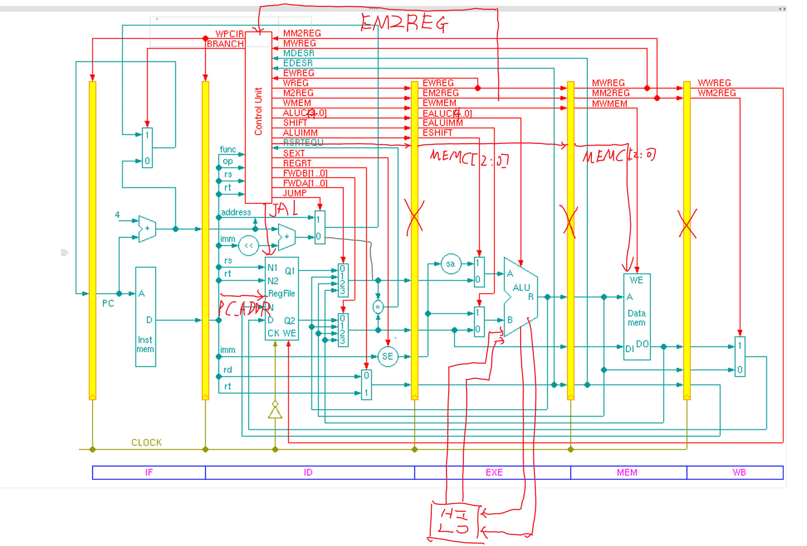
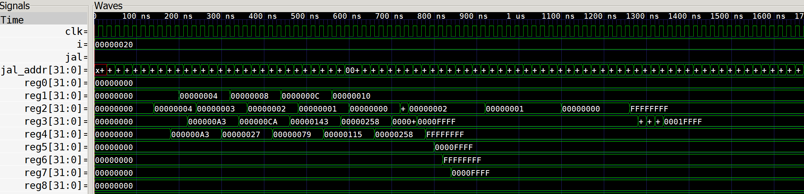

# Computer System Final Project

## Phase I: Pipeline CPU Design(simulation)

### Target
用五级流水完成wikipedia上的[MIPS instruction set](https://en.wikipedia.org/wiki/MIPS_instruction_set#MIPS_assembly_language)的所有(`mfcZ`和`mtcZ`涉及coprocessor, 暂不涉及)指令, 第一阶段只进行模拟, 不写在FPGA上.

### Environment
轻量级环境:Sublime + System Verilog Plugin + [iverilog](https://github.com/steveicarus/iverilog) + [gtkwave](http://gtkwave.sourceforge.net/).

为了在sublime上获得更好的自动补全体验, 可以安装[SublimeAllAutocomplete](https://github.com/alienhard/SublimeAllAutocomplete)插件.

列编辑功能在写verilog时非常好用, 在windows下用`shift+右键`启用.

Verilog快速入门: http://www.asic-world.com/verilog/verilog_one_day.html .
#### Installation
* Mac: [如何在Mac OS X上安裝Verilog環境](http://easonchang.logdown.com/posts/649863)
* Win: [Compiling on MS Windows](http://iverilog.wikia.com/wiki/Installation_Guide#Compiling_on_MS_Windows_.28MinGW.29)

Windows版的iverilog在win10+[cygwin](https://www.cygwin.com/)环境下表现良好(需要将cygwin安装目录下的`/usr/local/bin`加入环境变量), 如果make某个文件时遇到了`\r`的问题, 用`dos2unix file`就可以了.

gtkwave在win10的retina屏幕下显示很糟糕, 可以用[这里](http://stackoverflow.com/questions/24768200/how-to-get-emacs-text-to-render-as-crisply-as-netbeans)的方法解决.

#### Usage
编译并运行:
```
iverilog -o CPU CPU.v
vvp CPU
```

显示波形图(需要在`CPU.v`中加上`$dumpfile("CPU.vcd");`并指定`$dumpvars`):
```
gtkwave CPU.vcd
```

gtkwave默认不会显示波形, 需要将变量拖至右侧, 用快捷键`Alt+Z`和`Alt+Shift+Z`可以放大缩小.

### Assembler
GCC-toolchain可以用于构建MIPS指令集的二进制码.

### Design
框架由李亚民资料扩展而得.



去掉了一些中间寄存器的module, 改在`ex`, `mem`这些module中用`reg`类型保存中间变量.

设计的难点在于时序关系, 时序逻辑与组合逻辑的结合, 解决forwarding等等, 大部分控制相关的内容都放在control_unit中, 由于control_unit各个功能对应在一个周期中的时间不尽相同, 所以涉及为组合逻辑.

为了方便(减少hazard), `HI`和`LO` 与`ALU`直接相连, 避免了`mflo`及`mul`这样的hazard.

### Compile & Run

    iverilog -o cpu tb_expye_cpu.v
    vvp cpu
    gtkwave pipeline.vcd


图中是lym资料中test data的波形图(测试已通过).

### TODO

* 进行时序仿真.
* <del>剩余六条内存指令的实现(`lh`, `lhu`, `lb`, `lbu`, `sw`, `sb`). </del>(已完成)
* <del>将ram改成大端模式.</del>
* 写`makefile`.
* <del>解决一些没有处理的区分unsigned和signed的问题.</del>(已完成)
* 用宏代替一些繁杂的指令.

